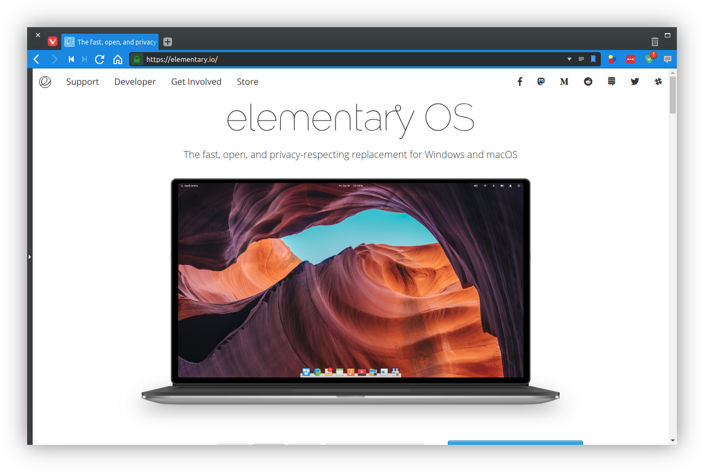

# Vivaldi tweaks for elementaryOS

#### Various tweaks to make Vivaldi look and work nicer in elementaryOS



## Install

### Get and setup the repository

```
$ git clone https://github.com/electricduck/vivaldi-elementaryos-tweaks
$ chmod +x install.sh
```

### Run script

```
$ sudo ./install.sh
```

### Add elementaryOS themes (Optional)

_So far, I am unaware of a method to automate this process. Also, please not a few themes included out-of-the-box do not work correctly when maximized._

 * Open **Settings**
 * Navigate to **Themes** tab
 * Press the **+** button to add new theme

#### Dark theme

 * **Background**: `#373D40`
 * **Foreground**: `#ECECEC`
 * **Highlight**: `#DBDBDB`
 * **Accent**: `#C83838`
 * **Theme Preferences**:
   * **Accent Colour from Active Page**: `[✓]`
   * **Apply Accent Colour to Window**: `[ ]`
   * **Transparent Tabs**: `[ ]`
   * **Corner Rounding**: `4px`

#### Light theme

_(Coming soon)_